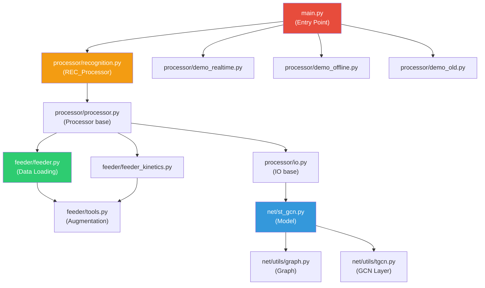
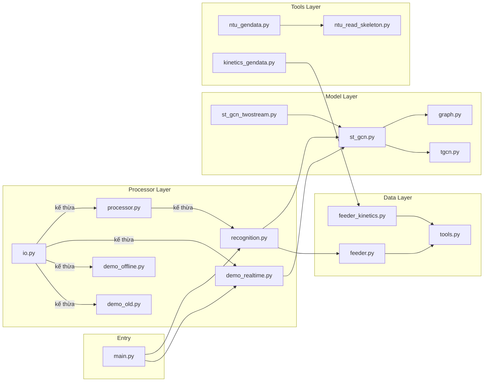

# 📖 Giải Thích Chi Tiết Từng File Trong Folder `st-gcn`

## 🗂️ Cây Thư Mục Tổng Quan

```
st-gcn/
├── main.py                          # 🚀 Điểm khởi chạy chương trình
├── requirements.txt                 # 📦 Danh sách thư viện cần cài
│
├── net/                             # 🧠 MẠNG NEURAL NETWORK (Mô hình)
│   ├── __init__.py
│   ├── st_gcn.py                    #   ├── Mô hình ST-GCN chính
│   ├── st_gcn_twostream.py          #   ├── Biến thể Two-Stream
│   └── utils/                       #   └── Các module con
│       ├── __init__.py
│       ├── graph.py                 #       ├── Xây dựng đồ thị skeleton
│       └── tgcn.py                  #       └── Lớp Graph Convolution
│
├── feeder/                          # 📊 NẠP DỮ LIỆU (Data Loading)
│   ├── __init__.py
│   ├── feeder.py                    #   ├── Feeder cho NTU RGB+D
│   ├── feeder_kinetics.py           #   ├── Feeder cho Kinetics
│   └── tools.py                     #   └── Hàm augmentation dữ liệu
│
├── processor/                       # ⚙️ ĐIỀU KHIỂN LUỒNG XỬ LÝ
│   ├── __init__.py
│   ├── io.py                        #   ├── Lớp IO cơ bản (load model, GPU)
│   ├── processor.py                 #   ├── Lớp Processor (train/test loop)
│   ├── recognition.py               #   ├── Processor cho nhận dạng hành động
│   ├── demo_old.py                  #   ├── Demo phiên bản cũ (offline)
│   ├── demo_offline.py              #   ├── Demo offline cải tiến
│   └── demo_realtime.py             #   └── Demo realtime từ camera/video
│
├── tools/                           # 🔧 CÔNG CỤ TIỀN XỬ LÝ DỮ LIỆU
│   ├── __init__.py
│   ├── get_models.sh                #   ├── Script tải pre-trained models
│   ├── ntu_gendata.py               #   ├── Tạo dữ liệu NTU RGB+D
│   ├── kinetics_gendata.py          #   ├── Tạo dữ liệu Kinetics
│   └── utils/                       #   └── Tiện ích
│       ├── __init__.py
│       ├── ntu_read_skeleton.py     #       ├── Đọc file skeleton NTU
│       ├── openpose.py              #       ├── Đóng gói output OpenPose
│       ├── video.py                 #       └── Xử lý video
│       └── visualization.py         #       └── Trực quan hóa kết quả
│
└── config/                          # 📝 CẤU HÌNH TRAINING/TESTING
    ├── st_gcn/                      #   ├── Config cho ST-GCN
    │   ├── kinetics-skeleton/       #   │   ├── Trên dataset Kinetics
    │   ├── ntu-xsub/                #   │   ├── NTU cross-subject
    │   └── ntu-xview/               #   │   └── NTU cross-view
    └── st_gcn.twostream/            #   └── Config cho Two-Stream
        ├── ntu-xsub/                #       ├── NTU cross-subject
        └── ntu-xview/               #       └── NTU cross-view
```

---

## 🏗️ Kiến Trúc Tổng Thể



**Luồng hoạt động:**
1. `main.py` → chọn processor phù hợp (recognition / demo)
2. Processor → load config → load model → load data → train/test/demo
3. Model (ST-GCN) → nhận skeleton data `(N, C, T, V, M)` → dự đoán hành động

---

## 📄 Chi Tiết Từng File

---

### 1. `main.py` — 🚀 Điểm Khởi Chạy

**Nhiệm vụ:** Entry point duy nhất của toàn bộ dự án. Nhận lệnh từ command line và khởi chạy processor tương ứng.

**Cách hoạt động:**
```
python main.py recognition --config config/st_gcn/ntu-xsub/train.yaml
python main.py demo --video ./video.mp4
```

| Processor | Class | Mục đích |
|-----------|-------|----------|
| `recognition` | `REC_Processor` | Training / Testing nhận dạng hành động |
| `demo` | `DemoRealtime` | Demo realtime từ camera hoặc video |
| `demo_offline` | `DemoOffline` | Demo offline (xử lý toàn bộ video trước) |
| `demo_old` | `Demo` | Demo phiên bản cũ (dùng OpenPose CLI) |

**Kỹ thuật:** Sử dụng `argparse.subparsers` để mỗi processor có bộ arguments riêng, kế thừa từ parser cha.

---

### 2. `net/st_gcn.py` — 🧠 Mô Hình ST-GCN Chính

**Nhiệm vụ:** Định nghĩa kiến trúc mạng Spatial-Temporal Graph Convolutional Network.

**Gồm 2 class:**

#### Class `Model(nn.Module)` — Mô hình tổng thể

| Thành phần | Mô tả |
|------------|--------|
| `self.graph` | Đồ thị skeleton (Graph object) |
| `self.A` | Ma trận kề (adjacency matrix), registered buffer |
| `self.data_bn` | BatchNorm chuẩn hóa input |
| `self.st_gcn_networks` | **10 lớp ST-GCN** xếp chồng |
| `self.edge_importance` | Trọng số học được cho mỗi cạnh |
| `self.fcn` | Conv2d(256, num_class) → phân loại |

**Kiến trúc 10 lớp:**
```
Input(3) → 64 → 64 → 64 → 64 → 128(↓) → 128 → 128 → 256(↓) → 256 → 256
                                      stride=2          stride=2
```

**Input shape:** `(N, C, T, V, M)` = (batch, channels=3, frames, joints, persons)

**Forward flow:**
1. Reshape `(N,C,T,V,M)` → `(N*M, V*C, T)` → BatchNorm → reshape lại
2. Qua 10 lớp ST-GCN, mỗi lớp nhân adjacency matrix với edge_importance
3. Global Average Pooling → trung bình qua persons → FC → output `(N, num_class)`

**Method `extract_feature`:** Giống forward nhưng trả về cả feature map (dùng cho visualization trong demo).

#### Class `st_gcn(nn.Module)` — Một khối ST-GCN đơn lẻ

Mỗi khối gồm:
```
Input → GCN (spatial) → TCN (temporal) + Residual → ReLU → Output
```

| Module | Chi tiết |
|--------|----------|
| `self.gcn` | `ConvTemporalGraphical` — graph convolution trên chiều không gian |
| `self.tcn` | Sequential: BatchNorm → ReLU → Conv2d(kernel=9×1) → BatchNorm → Dropout |
| `self.residual` | Skip connection: identity / Conv1x1 / zero (tùy in/out channels) |

---

### 3. `net/utils/graph.py` — 📐 Xây Dựng Đồ Thị Skeleton

**Nhiệm vụ:** Tạo ma trận kề (adjacency matrix) `A` cho đồ thị skeleton dựa trên layout và chiến lược phân vùng.

#### Layouts hỗ trợ:

| Layout | Số joints | Mô tả |
|--------|-----------|--------|
| `openpose` | 18 | Skeleton từ OpenPose (COCO format) |
| `ntu-rgb+d` | 25 | Skeleton từ Kinect (dataset NTU) |
| `ntu_edge` | 24 | Biến thể NTU (bỏ 1 joint) |

#### Partition Strategies (chiến lược phân vùng):

| Strategy | Shape A | Mô tả |
|----------|---------|--------|
| `uniform` | `(1, V, V)` | Tất cả neighbor cùng trọng số |
| `distance` | `(D, V, V)` | Phân theo khoảng cách hop |
| `spatial` | `(3, V, V)` | **Quan trọng nhất!** Chia thành: root / closer to center / further from center |

**Hàm phụ trợ:**
- `get_hop_distance()` — Tính khoảng cách giữa mọi cặp node bằng lũy thừa ma trận
- `normalize_digraph()` — Chuẩn hóa ma trận kề (D⁻¹·A)
- `normalize_undigraph()` — Chuẩn hóa đối xứng (D⁻¹/²·A·D⁻¹/²)

---

### 4. `net/utils/tgcn.py` — 🔗 Lớp Graph Convolution

**Nhiệm vụ:** Implement phép **Graph Convolution** — thao tác cốt lõi của ST-GCN.

**Class `ConvTemporalGraphical`:**

**Ý tưởng:**
1. Dùng `Conv2d` để biến đổi channels: `(N, in_ch, T, V)` → `(N, out_ch*K, T, V)`
2. Reshape thành `(N, K, out_ch, T, V)`
3. Nhân với ma trận kề `A(K, V, V)` bằng `torch.einsum('nkctv,kvw->nctw')`

**Công thức:** `Output = Σ_k (Conv(X)_k × A_k)` — tổng qua K kernel kề

> [!IMPORTANT]
> Đây là phần **cốt lõi** của bài báo ST-GCN. `einsum` thực hiện phép tích ma trận đồ thị, truyền thông tin giữa các node lân cận.

---

### 5. `net/st_gcn_twostream.py` — 🔀 Biến Thể Two-Stream

**Nhiệm vụ:** Kết hợp 2 luồng ST-GCN:

| Stream | Input | Ý nghĩa |
|--------|-------|---------|
| `origin_stream` | `x` (tọa độ gốc) | Thông tin vị trí tĩnh |
| `motion_stream` | `m` (vi sai bậc 2) | Thông tin chuyển động |

**Motion `m`** được tính: `m[t] = x[t] - 0.5*x[t+1] - 0.5*x[t-1]` (xấp xỉ đạo hàm bậc 2)

**Output:** Cộng kết quả 2 stream → dự đoán cuối cùng.

---

### 6. `feeder/feeder.py` — 📊 Data Loader cho NTU RGB+D

**Nhiệm vụ:** Đọc dữ liệu skeleton đã được tiền xử lý (file `.npy`) cho dataset NTU RGB+D.

**Input data:** File `.npy` có shape `(N, C, T, V, M)`:
- `N` = số samples
- `C` = 3 (x, y, z)
- `T` = số frames
- `V` = số joints (25)
- `M` = số persons (2)

**Các tính năng:**
| Tham số | Chức năng |
|---------|----------|
| `random_choose` | Random cắt 1 đoạn `window_size` frames |
| `random_move` | Random xoay + co giãn + dịch chuyển |
| `window_size` | Padding nếu video ngắn hơn |
| `mmap` | Memory-mapped loading (tiết kiệm RAM) |
| `debug` | Chỉ dùng 100 samples đầu |

---

### 7. `feeder/feeder_kinetics.py` — 📊 Data Loader cho Kinetics

**Nhiệm vụ:** Đọc dữ liệu skeleton dạng JSON cho dataset Kinetics (từ OpenPose).

**Khác biệt với `feeder.py`:**

| Đặc điểm | feeder.py (NTU) | feeder_kinetics.py (Kinetics) |
|-----------|-----------------|-------------------------------|
| Format input | `.npy` (binary) | `.json` (text, mỗi video 1 file) |
| Joints | 25 (Kinect) | 18 (OpenPose COCO) |
| Channels | 3 (x,y,z) | 3 (x,y,score) |
| Multi-person | Cố định 2 | Observe 5, chọn top 2 theo score |
| Centralization | Không | Có (trừ 0.5) |
| Pose matching | Không | Có (`openpose_match`) |

**Đặc biệt:**
- Lọc bỏ samples không có skeleton (`ignore_empty_sample`)
- Sort persons theo `score` rồi giữ top-K
- Hỗ trợ `top_k_by_category`, `calculate_recall_precision` để evaluate

---

### 8. `feeder/tools.py` — 🛠️ Các Hàm Data Augmentation

**Nhiệm vụ:** Cung cấp các hàm biến đổi dữ liệu skeleton cho augmentation và preprocessing.

| Hàm | Chức năng |
|-----|----------|
| `downsample()` | Giảm frame rate (lấy mỗi `step` frames) |
| `temporal_slice()` | Chia nhỏ theo thời gian |
| `mean_subtractor()` | Trừ giá trị trung bình |
| `auto_pading()` | Padding zeros cho video ngắn |
| `random_choose()` | Random cắt 1 đoạn liên tục |
| `random_move()` | **Augmentation chính:** random xoay (±10°), co giãn (0.9-1.1), dịch chuyển (±0.2) |
| `random_shift()` | Dịch random vị trí thời gian của skeleton |
| `openpose_match()` | Match poses giữa các frame liên tiếp (tracking đơn giản) |
| `top_k_by_category()` | Tính accuracy Top-K theo từng class |
| `calculate_recall_precision()` | Tính recall/precision từ confusion matrix |

> [!TIP]
> `random_move()` là augmentation quan trọng nhất — nó apply xoay, co giãn, và dịch chuyển liên tục (dùng interpolation giữa các keyframe), giúp model robust hơn.

---

### 9. `processor/io.py` — 🔌 Lớp IO Cơ Bản

**Nhiệm vụ:** Lớp **nền tảng** xử lý các tác vụ I/O: đọc config, load model, load weights, chuyển lên GPU.

**Cấp bậc kế thừa:** `IO` ← `Processor` ← `REC_Processor`

**Phương thức:**
| Method | Chức năng |
|--------|----------|
| `load_arg()` | Parse CLI args + merge với config YAML |
| `init_environment()` | Tạo thư mục work_dir, cấu hình GPU |
| `load_model()` | Dùng `torchlight.IO.load_model()` để import model class theo tên |
| `load_weights()` | Load pre-trained weights, bỏ qua weights trong `ignore_weights` |
| `gpu()` | Chuyển model sang GPU, hỗ trợ `DataParallel` nếu multi-GPU |

**Arguments:** `--work_dir`, `--config`, `--use_gpu`, `--device`, `--model`, `--weights`, ...

---

### 10. `processor/processor.py` — ⚙️ Base Processor (Train/Test Loop)

**Nhiệm vụ:** Kế thừa `IO`, thêm khả năng **train/test loop, load data, logging**.

**Phương thức mới:**
| Method | Chức năng |
|--------|----------|
| `load_data()` | Tạo DataLoader cho train và test từ Feeder |
| `load_optimizer()` | Placeholder (override ở lớp con) |
| `show_epoch_info()` | In thông tin cuối mỗi epoch |
| `show_iter_info()` | In thông tin mỗi `log_interval` iterations |
| `train()` | **Placeholder** — default chạy 100 iter với loss=0 |
| `test()` | **Placeholder** — default chạy 100 iter với loss=1 |
| `start()` | **Main loop:** lặp epochs → train → save model → eval |

**Luồng `start()` khi phase='train':**
```
for epoch in range(num_epoch):
    train()
    if epoch % save_interval == 0: save_model()
    if epoch % eval_interval == 0: test()
```

---

### 11. `processor/recognition.py` — 🎯 Processor Nhận Dạng Hành Động

**Nhiệm vụ:** Kế thừa `Processor`, **override** toàn bộ logic train/test cho bài toán action recognition thực tế.

**Override methods:**

#### `load_model()`:
- Load model + apply `weights_init` (khởi tạo Conv: N(0, 0.02), BN: N(1, 0.02))
- Tạo loss = `CrossEntropyLoss`

#### `load_optimizer()`:
- SGD (momentum=0.9, nesterov) hoặc Adam

#### `adjust_lr()`:
- Step decay: lr giảm 10x tại các epoch trong `--step`

#### `train()`:
```python
for data, label in loader:
    output = model(data)          # forward
    loss = CrossEntropyLoss(output, label)
    loss.backward()               # backward
    optimizer.step()              # update
```

#### `test()`:
```python
for data, label in loader:
    with torch.no_grad():
        output = model(data)      # inference
    # tính loss, gom kết quả
# show Top-1, Top-5 accuracy
```

---

### 12. `processor/demo_realtime.py` — 🎥 Demo Realtime

**Nhiệm vụ:** Nhận dạng hành động **realtime** từ camera hoặc video, sử dụng OpenPose Python API.

**Luồng hoạt động:**
```
Camera/Video → OpenPose (pose estimation) → Normalize → Pose Tracking → ST-GCN (predict) → Visualization
```

**Gồm 2 class:**

#### `DemoRealtime(IO)`:
- `start()` — Main loop: đọc frame → OpenPose → tracking → predict → hiển thị
- `predict()` — Forward model, lấy voting label + per-frame label + feature intensity
- `render()` — Vẽ skeleton + label lên hình

#### `naive_pose_tracker`:
- Tracker đơn giản theo khoảng cách giữa pose liên tiếp
- `update()` — Match pose mới vào trace cũ hoặc tạo trace mới
- `get_skeleton_sequence()` — Trả về tensor `(3, T, V, M)` cho model

---

### 13. `processor/demo_offline.py` — 📹 Demo Offline

**Nhiệm vụ:** Xử lý **toàn bộ video trước**, rồi mới hiển thị kết quả.

**Khác biệt với realtime:**
- Chạy OpenPose trên toàn bộ video trước → thu thập hết poses
- Sau đó forward model 1 lần duy nhất trên toàn bộ sequence
- Hiển thị kết quả đã được render

**Dùng cùng `naive_pose_tracker`** (copy giống realtime).

---

### 14. `processor/demo_old.py` — 📼 Demo Phiên Bản Cũ

**Nhiệm vụ:** Demo dùng **OpenPose CLI** (chạy qua `os.system`) thay vì Python API.

**Luồng:**
1. Gọi OpenPose binary → xuất JSON files cho từng frame
2. `utils.openpose.json_pack()` — gom JSON thành 1 dict
3. `utils.video.video_info_parsing()` — chuyển thành numpy array
4. Forward model → lấy prediction + feature
5. `utils.visualization.stgcn_visualize()` — tạo video kết quả
6. Lưu thành file `.mp4`

---

### 15. `tools/ntu_gendata.py` — 🏭 Tạo Dữ Liệu NTU RGB+D

**Nhiệm vụ:** Chuyển đổi file `.skeleton` thô từ dataset NTU RGB+D thành file `.npy` cho training.

**Dataset splits:**

| Benchmark | Training set | Test set |
|-----------|-------------|----------|
| `xsub` (Cross-Subject) | 20 subjects cố định | Phần còn lại |
| `xview` (Cross-View) | Camera 2, 3 | Camera 1 |

**Output:** Mỗi split tạo 2 file:
- `{part}_data.npy` — shape `(N, 3, 300, 25, 2)` — memory-mapped
- `{part}_label.pkl` — `(sample_names, labels)`

**Dùng** `read_xyz()` từ `tools/utils/ntu_read_skeleton.py` để parse file `.skeleton`.

---

### 16. `tools/kinetics_gendata.py` — 🏭 Tạo Dữ Liệu Kinetics

**Nhiệm vụ:** Chuyển JSON skeleton data từ Kinetics thành `.npy`.

**Logic:**
1. Tạo `Feeder_kinetics` (đọc JSON, augment, sort by score)
2. Lặp qua tất cả samples → lưu vào memory-mapped `.npy`
3. Lưu label vào `.pkl`

**Output shape:** `(N, 3, 300, 18, 2)` — 18 joints OpenPose, 2 persons

---

### 17. `tools/utils/ntu_read_skeleton.py` — 📖 Đọc File Skeleton NTU

**Nhiệm vụ:** Parse file `.skeleton` text format từ NTU RGB+D dataset.

**2 hàm:**
| Hàm | Chức năng |
|-----|----------|
| `read_skeleton()` | Đọc toàn bộ file → dict chứa frameInfo → bodyInfo → jointInfo |
| `read_xyz()` | Chỉ lấy tọa độ (x,y,z) → numpy array `(3, T, V, M)` |

**Cấu trúc file .skeleton:**
```
numFrame
  numBody (per frame)
    bodyID, clipedEdges, ...
    numJoint
      x, y, z, depthX, depthY, colorX, colorY, orientW, orientX, orientY, orientZ, trackingState
```

---

### 18. `tools/utils/openpose.py` — 📦 Đóng Gói Output OpenPose

**Nhiệm vụ:** Gom các file JSON output của OpenPose (mỗi frame 1 file) thành 1 dict duy nhất.

**Function `json_pack()`:**
- Input: Thư mục chứa JSON files, tên video, kích thước frame
- Output: Dict `{data: [{frame_index, skeleton: [{pose, score}]}], label, label_index}`
- Tọa độ được **normalize** theo width/height

---

### 19. `tools/utils/video.py` — 🎬 Xử Lý Video

**Nhiệm vụ:** Các tiện ích đọc và parse video.

| Hàm | Chức năng |
|-----|----------|
| `video_info_parsing()` | Chuyển dict skeleton → numpy `(3,T,18,M)`, centralize, sort by score, chọn top-2 persons |
| `get_video_frames()` | Đọc video thành list frames (dùng `skvideo`) |
| `video_play()` | Phát video đơn giản bằng OpenCV |

---

### 20. `tools/utils/visualization.py` — 🎨 Trực Quan Hóa

**Nhiệm vụ:** Tạo visualization đẹp cho demo: vẽ skeleton, attention map, label lên video.

**Function `stgcn_visualize()` — Generator:**
Mỗi frame tạo ảnh 2×2:
```
┌──────────────────┬──────────────────┐
│  Original Video  │  Pose Skeleton   │
├──────────────────┼──────────────────┤
│ Attention+Predict│  Attention+RGB   │
└──────────────────┴──────────────────┘
```

**Các thành phần:**
- **Skeleton overlay**: Vẽ xương bằng `cv2.line`
- **Attention mask**: Feature intensity → circle size → blur
- **Label text**: Tên hành động cho mỗi person
- **FPS display**: Hiển thị tốc độ xử lý

---

### 21. `tools/get_models.sh` — ⬇️ Tải Pre-trained Models

**Nhiệm vụ:** Script bash tải pre-trained weights và COCO pose model.

**Tải:**
1. ST-GCN pre-trained models từ S3 bucket
2. OpenPose COCO model (`pose_iter_440000.caffemodel`)

---

### 22. `config/` — 📝 Các File Cấu Hình

**Cấu trúc:**
```
config/
├── st_gcn/
│   ├── kinetics-skeleton/     # Config cho Kinetics dataset
│   ├── ntu-xsub/              # Config NTU Cross-Subject
│   └── ntu-xview/             # Config NTU Cross-View
└── st_gcn.twostream/
    ├── ntu-xsub/
    └── ntu-xview/
```

Mỗi thư mục thường chứa YAML files chỉ định: model class, graph layout, feeder, learning rate, batch size, v.v.

---

## 🔗 Tóm Tắt Mối Quan Hệ Giữa Các File



> [!NOTE]
> **Chuỗi kế thừa quan trọng nhất:**
> `IO` → `Processor` → `REC_Processor`
>
> - `IO`: load model, load weights, GPU setup
> - `Processor`: thêm data loading, train/test loop template
> - `REC_Processor`: implement thực tế train/test cho action recognition
